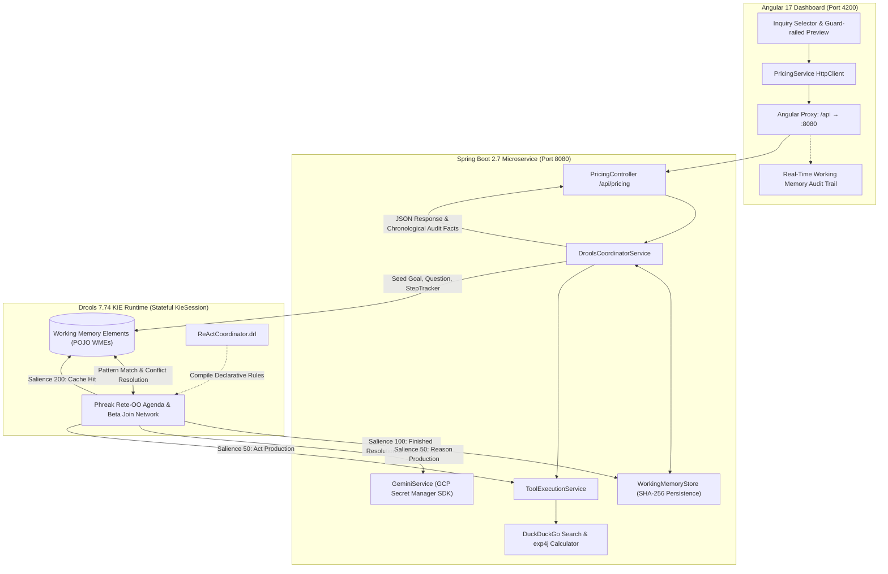

# ReAct Drools: Enterprise Neuro-Symbolic Rules Coordinator

[](https://www.oracle.com/java/)
[](https://spring.io/projects/spring-boot)
[](https://www.drools.org/)
[](https://angular.io/)
[](https://cloud.google.com/secret-manager)
[](#architectural-overview)

An enterprise reference architecture demonstrating **Neuro-Symbolic Agent Governance** using the **Drools Business Rules Engine (Phreak Rete-OO algorithm)**, **Spring Boot**, and **Angular 17**. 

This system demonstrates the paradigm of **Rules as Coordinator**: delegating generative reasoning to a Large Language Model (Gemini) while constraining execution flow, tool dispatch, termination criteria, and working memory persistence within a deterministic, forward-chaining production rule engine.

---

## Theoretical Grounding: ReAct as an Enterprise Pattern

This implementation operationalizes the foundational **ReAct (Reason + Act)** pattern introduced in:

> **Hands-On Large Language Models**  
> *Jay Alammar & Maarten Grootendorst* (O'Reilly Media)  
> **Chapter 7: "Reason and Act"** — Demonstrating agent control loops for multi-step product pricing and currency conversion.

### The Problem: Stochastic Drift in Autonomous Agents
The classic ReAct formulation tasks an LLM with iteratively formulating thoughts, selecting actions from a tool registry, and digesting observations until reaching a final answer. In Alammar's foundational scenario:
1. An agent must determine the starting retail price (MSRP) of hardware in USD.
2. The agent must convert that price to an international currency using an exact exchange rate.
3. The agent must delegate arithmetic to a calculator rather than hallucinating mathematical operations.

In standard agentic frameworks, this loop is driven by unconstrained, recursive prompt chains. In mission-critical enterprise domains (finance, banking, supply chain, healthcare), this probabilistic approach introduces significant operational risks:
* **Runaway iteration loops** and runaway token consumption when tool outputs are ambiguous.
* **Non-deterministic termination**, where the LLM prematurely concludes without verifying required facts.
* **State fragility**, where intermediate reasoning state is stored in ephemeral string buffers rather than strongly-typed, auditable working memory.

### The Solution: Rules as Coordinator
By embedding the ReAct loop within a **Business Rules Management System (BRMS)**, we invert control:
* **The LLM is a Generative Co-Processor**: It generates semantic hypotheses and proposes actions.
* **Drools is the Prefrontal Cortex**: The Drools forward-chaining engine maintains stateful working memory, evaluates beta-network pattern joins across facts, enforces iteration bounds through agenda salience, guarantees tool validation, and manages episodic memory persistence.

---

## Architectural Overview



---

## The Drools Agenda & Production Rules (`ReActCoordinator.drl`)

The reasoning cycle is governed declaratively through **agenda salience**, ensuring strict precedence without imperative branching:

```
[Salience 200] Rule 0: Load Cached Working Memory    (O(1) Episodic Recall)
      │
      ├── (Cache Miss) ────────────────────────────────────────────────────────┐
      ▼                                                                        ▼
[Salience 50]  Rule 3: Reason Production                             [Salience 50] Rule 4: Act Production
(Compose Scratchpad & Invoke LLM)                                    (Dispatch Tool / Assert Observation)
      │                                                                        │
      └───────────────────────────────┬────────────────────────────────────────┘
                                      ▼
                        [Salience 100] Rule 1: Finished Fact Resolution
                        (Persist Newly Deduced WM to Disk & Terminate)
                                      ▲
                                      │ (If Step > Max Allowed)
                        [Salience 95]  Rule 2: Max Iterations Reached
                        (Hard Circuit Breaker)
```

### Production Rule Definitions

#### Rule 0: `Load Cached Working Memory` (`salience 200`)
Fires on the initial query encounter (`step == 1`) if the query's SHA-256 hash exists in episodic storage. It deserializes the stored facts, **substitutes the active session ID**, restores the persisted `StepTracker`, asserts the historical facts into working memory, and transitions `Goal` to `FINISHED`. Live LLM calls and tool executions are completely bypassed:
```drools
rule "Load Cached Working Memory"
    salience 200
    when
        $g : Goal($sid : sessionId, goalType == Goal.REASON, step == 1)
        $q : Question(sessionId == $sid, $qText : text)
        eval(wmStore != null && wmStore.exists($qText))
    then
        List cachedFacts = wmStore.load($qText, $sid);
        for (Object factObj : cachedFacts) {
            if (!(factObj instanceof Question) && !(factObj instanceof Goal)) {
                insert(factObj);
            }
        }
        modify($g) { setGoalType(Goal.FINISHED) };
end
```

#### Rule 1: `Finished Fact Resolution` (`salience 100`)
Pushes termination logic directly into the inference engine. When a terminal `Finished` fact is asserted, this rule intercepts it before any further reasoning or tool actions can execute. In the absence of a pre-existing cache, it serializes all working memory elements into disk storage keyed by the query hash:
```drools
rule "Finished Fact Resolution"
    salience 100
    when
        $f : Finished($sid : sessionId)
        $g : Goal(sessionId == $sid, goalType != Goal.FINISHED)
        $q : Question(sessionId == $sid, $qText : text)
    then
        if (wmStore != null && !wmStore.exists($qText)) {
            wmStore.save($qText, $sid, drools.getKieRuntime().getObjects());
        }
        modify($g) { setGoalType(Goal.FINISHED) };
end
```

#### Rule 2: `Max Iterations Reached` (`salience 95`)
An architectural guard preventing infinite loops or budget depletion. If the current step exceeds `maxSteps` (default: 8), it forces termination:
```drools
rule "Max Iterations Reached"
    salience 95
    when
        $g : Goal($sid : sessionId, goalType == Goal.REASON)
        $tracker : StepTracker(sessionId == $sid, currentStep > maxSteps, $currStep : currentStep)
    then
        insert(new Finished($sid, $currStep, "Reached maximum iteration limit without final answer."));
        modify($g) { setGoalType(Goal.FINISHED) };
end
```

#### Rule 3: `Reason Production` (`salience 50`)
Scans working memory for all prior `Thought`, `Action`, `ActionInput`, and `Observation` facts for the session, dynamically synthesizes the ReAct scratchpad, and invokes the Gemini API:
```drools
rule "Reason Production"
    salience 50
    when
        $g : Goal($sid : sessionId, goalType == Goal.REASON)
        $tracker : StepTracker(sessionId == $sid, currentStep <= maxSteps, $currStep : currentStep)
        $q : Question(sessionId == $sid, $qText : text)
    then
        String scratchpad = templateBean.buildScratchpad(drools.getKieRuntime().getObjects(), $sid, $currStep);
        String prompt = templateBean.composePrompt(toolService.getToolsDescription(), toolService.getToolNames(), $qText, scratchpad);
        String predText = geminiService.invoke(prompt);
        insert(new LLMPrediction($sid, $currStep, predText));
        modify($g) { setGoalType(Goal.ACT) };
end
```

#### Rule 4: `Act Production` (`salience 50`)
Parses the model prediction. If the model reached `Final Answer:`, it asserts `Finished` (triggering Rule 1). Otherwise, it extracts the requested tool (`duckduck` or `Calculator`), executes it, asserts the resulting `Observation` into working memory, increments `StepTracker`, and cycles back to `Goal.REASON`:
```drools
rule "Act Production"
    salience 50
    when
        $g : Goal($sid : sessionId, goalType == Goal.ACT)
        $pred : LLMPrediction(sessionId == $sid, $predText : text, $predStep : step)
        $tracker : StepTracker(sessionId == $sid, $currStep : currentStep)
    then
        ParsedReActResponse parsed = templateBean.decomposeResponse($predText);
        retract($pred);
        if (parsed.isFinalAnswer()) {
            insert(new Thought($sid, $currStep, parsed.getThought()));
            insert(new FinalAnswer($sid, $currStep, parsed.getFinalAnswer()));
            insert(new Finished($sid, $currStep, parsed.getFinalAnswer()));
        } else {
            insert(new Thought($sid, $currStep, parsed.getThought()));
            insert(new Action($sid, $currStep, parsed.getAction()));
            insert(new ActionInput($sid, $currStep, parsed.getActionInput()));
            String obs = toolService.executeTool(parsed.getAction(), parsed.getActionInput());
            insert(new Observation($sid, $currStep, obs));
            int nextStep = $currStep + 1;
            modify($tracker) { setCurrentStep(nextStep) };
            modify($g) { setGoalType(Goal.REASON), setStep(nextStep) };
        }
end
```

---

## First-Class Drools Fact Model

Working Memory Elements (WMEs) are strongly-typed, serializable POJOs under `io.freelance.kjm.react.facts`:

| Fact Class | Role in Working Memory | Key Attributes |
| :--- | :--- | :--- |
| **`Goal`** | The active coordination state driving the agenda | `sessionId`, `goalType` (`Reason`, `Act`, `Finished`), `step`, `product`, `targetCurrency`, `exchangeRate` |
| **`StepTracker`** | Explicit loop counter & threshold guard | `sessionId`, `currentStep`, `maxSteps` |
| **`Question`** | Guard-railed user inquiry injected at step 1 | `sessionId`, `step`, `text` |
| **`Thought`** | Trace of semantic reasoning recorded at each step | `sessionId`, `step`, `text` |
| **`Action`** | Dispatched tool selection | `sessionId`, `step`, `name` (`duckduck`, `Calculator`) |
| **`ActionInput`** | Payload passed to the chosen tool | `sessionId`, `step`, `text` |
| **`Observation`** | Perceived outcome from tool execution | `sessionId`, `step`, `text` |
| **`LLMPrediction`** | Ephemeral raw prediction fact awaiting decomposition | `sessionId`, `step`, `text` |
| **`FinalAnswer`** | Extracted terminal conclusion | `sessionId`, `step`, `text` |
| **`Finished`** | Milestone fact asserting successful cycle completion | `sessionId`, `step`, `finalAnswer` |
| **`ToolFact`** | Tool declaration registered in working memory | `name`, `description` |

---

## Enterprise Engineering Highlights

### 1. Zero-Credential Exposure via Google Cloud Secret Manager
* Direct integration with `com.google.cloud:google-cloud-secretmanager` (GCP BOM `26.37.0`).
* Authenticates automatically via **Application Default Credentials (ADC)** (`gcloud auth application-default login`), resolving secrets dynamically from `projects/veytel-cloud-store/secrets/gemini-api-key/versions/latest`.
* Complete fallback hierarchy: Spring property $\rightarrow$ JVM system property $\rightarrow$ Environment variables $\rightarrow$ GCP Secret Manager.
* No API keys are committed or exposed in property files.

### 2. Deterministic Episodic Memory (`WorkingMemoryStore`)
* Every prompt is normalized and hashed via **SHA-256**.
* Upon completing an inference cycle, the full set of working memory facts is persisted to `backend/wm_storage/{query_hash}.json`.
* Subsequent inquiries with matching parameters load the materialized facts in **< 3 ms**, transparently replacing the session ID across all facts while preserving the step tracker and full audit trail.

### 3. Safe Industrial Tooling
* **Calculator (`CalculatorService`)**: Uses Dijkstra's Shunting-Yard algorithm and Reverse Polish Notation via `net.objecthunter:exp4j` to parse and compute complex mathematical expressions safely without arbitrary code execution.
* **Search (`DuckDuckGoSearchService`)**: HTML-parsing web extraction with fallback retail indices for offline resilience.

### 4. Interactive Angular 17 Dashboard
* Real-time **"Synthesized Question (Guard-railed)"** preview box showing the exact query being generated.
* Dynamic **Knowledge Source Badges**:
  * `⚡ Materialized Working Memory (Cached)` with SHA-256 hash prefix.
  * `🌐 Live Gemini LLM Inference` with active model metadata.
* Chronological, color-coded **ReAct Working Memory Audit Timeline** (`Thought`, `Action`, `Observation`, `Finished`).

---

## Directory Structure

```
ReActDrools/
├── backend/                                  # Spring Boot + Drools Gradle Subproject
│   ├── gradlew, gradlew.bat                  # Gradle 8.14.2 wrapper
│   ├── build.gradle                          # Java 17, Spring Boot 2.7.18, Drools 7.74.1, GCP BOM
│   ├── settings.gradle
│   ├── start_backend.sh                      # Backend boot script
│   ├── run_tests.sh                          # JUnit 5 test runner script
│   ├── wm_storage/                           # Materialized Working Memory JSON store
│   └── src/
│       ├── main/
│       │   ├── java/io/freelance/kjm/react/
│       │   │   ├── ReActDroolsApplication.java
│       │   │   ├── config/                   # DroolsConfig (KieContainer) & CorsConfig
│       │   │   ├── controllers/              # PricingController, OptionsController, HealthController
│       │   │   ├── dto/                      # PricingRequest, PricingResponse, AuditItemDto
│       │   │   ├── facts/                    # 11 strongly-typed Fact POJOs
│       │   │   ├── services/                 # DroolsCoordinatorService, GeminiService, ToolExecutionService
│       │   │   ├── storage/                  # WorkingMemoryStore (SHA-256 persistence/loading)
│       │   │   └── template/                 # ReActTemplateBean & ParsedReActResponse
│       │   └── resources/
│       │       ├── application.properties
│       │       ├── META-INF/kmodule.xml      # KIE Module & Session descriptor
│       │       └── rules/
│       │           └── ReActCoordinator.drl  # Rules 0-4 (Salience 200, 100, 95, 50)
│       └── test/java/io/freelance/kjm/react/
│           ├── DroolsReActCoordinatorTest.java # 2-turn cycle, rule salience & cache tests
│           ├── CalculatorServiceTest.java
│           ├── DuckDuckGoSearchServiceTest.java
│           ├── GeminiServiceTest.java
│           └── ReActTemplateBeanTest.java
│
├── frontend/                                 # Angular 17 Standalone SPA Subproject
│   ├── package.json                          # Angular 17.3, RxJS, TypeScript 5.4, Tailwind CSS
│   ├── proxy.conf.json                       # Reverse proxy: /api -> http://localhost:8080
│   ├── start_frontend.sh                     # Frontend run script
│   └── src/app/
│       ├── app.component.ts                  # Reactive coordinator caller & dynamic prompt synthesizer
│       ├── app.component.html                # Inquiry controls, query preview & audit timeline
│       ├── models.ts                         # TypeScript interfaces
│       └── pricing.service.ts                # HttpClient API service
│
├── start_all.sh                              # Full stack orchestrator
└── README.md                                 # Technical documentation
```

---

## Quickstart & Local Execution

### Prerequisites
* **Java 17+** (`java -version`)
* **Node.js 18+** & **npm** (`node -v && npm -v`)
* **Google Cloud SDK** (optional, for live Gemini inference via ADC):
  ```bash
  gcloud auth application-default login
  ```

### 1. Launch Spring Boot Backend
```bash
cd backend
./start_backend.sh
```
*The service compiles via the Gradle wrapper, initializes the Drools `KieContainer`, and listens on **`http://localhost:8080`**.*

### 2. Launch Angular Frontend
In a second terminal:
```bash
cd frontend
./start_frontend.sh
```
*The Angular development server will compile and open on **`http://localhost:4200`** with proxying configured to `:8080`.*

---

## Automated Test Suite

Run the full JUnit 5 test suite via the Gradle wrapper:
```bash
cd backend
./gradlew test
```
The test suite verifies:
1. **`DroolsReActCoordinatorTest`**: Multi-turn ReAct perception-action cycles, tool execution, Rule 1 cache serialization, and Rule 0 high-salience cache hits (bypassing LLM calls with 0 invocations).
2. **`CalculatorServiceTest`**: Expression sanitization, arithmetic evaluation, decimal precision, and error handling.
3. **`DuckDuckGoSearchServiceTest`**: Search execution, catalog lookup, snippet sanitization, and fallback behavior.
4. **`ReActTemplateBeanTest`**: Regex partitioning of Thought/Action/Action Input/Final Answer, and scratchpad history reconstruction.
5. **`GeminiServiceTest`**: API payload formatting, ADC key resolution, and response parsing.

---

## REST API Specification

### Health Check
```bash
curl -s http://localhost:8080/health | jq
```
```json
{
  "stack": "Spring Boot 2.7.18 (Java 17)",
  "paradigm": "Neuro-Symbolic ReAct Rule Coordinator",
  "engine": "Drools 7.74.1.Final (Phreak Rete-OO)",
  "status": "ok"
}
```

### Dispatch Pricing Coordination
```bash
curl -s -X POST http://localhost:8080/api/pricing \
  -H "Content-Type: application/json" \
  -d '{
    "product": "Apple MacBook Pro 14\"",
    "currency_code": "EUR",
    "currency_name": "Euro",
    "exchange_rate": 0.85
  }' | jq
```

#### Sample Response Payload:
```json
{
  "success": true,
  "session_id": "sess-9c4b2a1e8f3d",
  "product": "Apple MacBook Pro 14\"",
  "currency": "EUR",
  "exchange_rate": 0.85,
  "query": "What is the total retail purchase price (MSRP) of a new entry-level Apple MacBook Pro 14\" in USD? Do not use monthly financing. How much would it cost in Euro (EUR) if the exchange rate is 0.85 EUR for 1 USD? Use the Calculator tool to do the conversion. Do not do it yourself.",
  "query_hash": "b2f8a1c9e47d6e5309d841b8314e1f72948c2637b8393c004fa92023d8c119ae",
  "final_answer": "The total retail purchase price (MSRP) of a new entry-level Apple MacBook Pro 14\" is $1,599.00 USD. At an exchange rate of 0.85 EUR for 1 USD, it costs approximately 1,359.15 EUR.",
  "status": "COMPLETED",
  "cached": false,
  "knowledge_source": "Live Gemini LLM Inference (gemini-2.5-flash)",
  "rules_fired": 5,
  "audit_facts": [
    {
      "step": 1,
      "kind": "Thought",
      "content": "I need to find the total retail purchase price (MSRP) of a new entry-level Apple MacBook Pro 14\" in USD first."
    },
    {
      "step": 1,
      "kind": "Action",
      "content": "Tool: duckduck | Input: total retail purchase price MSRP of a new entry level Apple MacBook Pro 14 in USD"
    },
    {
      "step": 1,
      "kind": "Observation",
      "content": "snippet: The entry-level 14-inch MacBook Pro starting configuration MSRP is $1,599.00 USD..."
    },
    {
      "step": 2,
      "kind": "Thought",
      "content": "The MSRP is $1,599 USD. Now I need to calculate how much it would cost in Euro (EUR) with an exchange rate of 0.85 EUR for 1 USD using the Calculator tool."
    },
    {
      "step": 2,
      "kind": "Action",
      "content": "Tool: Calculator | Input: 1599 * 0.85"
    },
    {
      "step": 2,
      "kind": "Observation",
      "content": "1359.15"
    },
    {
      "step": 3,
      "kind": "Final Answer",
      "content": "The total retail purchase price (MSRP) of a new entry-level Apple MacBook Pro 14\" is $1,599.00 USD. At an exchange rate of 0.85 EUR for 1 USD, it costs approximately 1,359.15 EUR."
    },
    {
      "step": 4,
      "kind": "Finished",
      "content": "The total retail purchase price (MSRP) of a new entry-level Apple MacBook Pro 14\" is $1,599.00 USD. At an exchange rate of 0.85 EUR for 1 USD, it costs approximately 1,359.15 EUR."
    }
  ]
}
```
