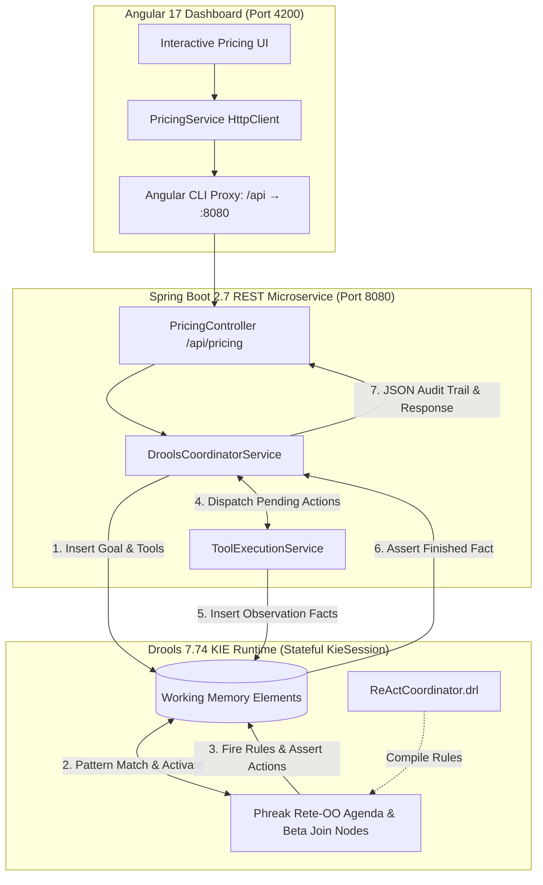

# ReAct Drools: Enterprise Neuro-Symbolic Rules Coordinator

[](https://www.oracle.com/java/)
[](https://spring.io/projects/spring-boot)
[](https://www.drools.org/)
[](https://angular.io/)
[](#architectural-overview)

An enterprise-grade reference architecture demonstrating **Neuro-Symbolic Agent Supervision** through the **Drools Business Rules Engine (Phreak Rete-OO algorithm)**, integrated into a high-throughput **Spring Boot** service and driven by an **Angular 17** dashboard.

This project is the enterprise Java/Angular counterpart to the Python-based [PyRete FARM stack](https://github.com/mitchellkj/PyRete), establishing parity across two distinct enterprise software paradigms:
1. **Lightweight Python Ecosystem**: FastAPI + React (Next.js 14) + PyRete
2. **Enterprise JVM Ecosystem**: Spring Boot + Angular 17 + Drools 7.74 (KIE Container)

---

## Provenance & Theoretical Grounding

This project operationalizes the classic **ReAct (Reason + Act)** pattern introduced in:

> **Hands-On Large Language Models**  
> *Jay Alammar & Maarten Grootendorst* (O'Reilly Media)  
> **Chapter 7: "Reason and Act"** — Demonstrating agent control loops in international product pricing and currency conversion.

While the literature commonly implements ReAct via probabilistic LLM prompt chains (e.g., standard LangChain loops), this repository replaces the unconstrained agent loop with **deterministic forward-chaining production rules**. Drools acts as the **executive prefrontal cortex**, orchestrating when tools are dispatched, validating intermediate observations, and preventing stochastic drift.

---

## Architectural Overview



---

## First-Class Drools Fact Model

In alignment with Spring and Drools architectural standards, all Working Memory Elements (WMEs) are modeled as distinct, strongly-typed Java classes under `io.freelance.kjm.react.facts`:

| Fact Class | Purpose | Key Attributes |
| :--- | :--- | :--- |
| **`Goal`** | Primary objective driving the rule agenda | `sessionId`, `status` (`INIT`, `NEED_BASE_PRICE`, `AWAITING_SEARCH`, `AWAITING_CONVERSION`, `COMPLETED`), `product`, `targetCurrency`, `exchangeRate` |
| **`Thought`** | Internal plan formulation and reasoning state | `sessionId`, `step`, `content`, `timestamp` |
| **`Action`** | Dispatched tool invocation request | `sessionId`, `step`, `toolName` (`duckduck`, `Calculator`), `actionInput`, `status` (`PENDING`, `EXECUTED`) |
| **`ActionInput`** | Typed argument payload passed to tools | `rawInput`, `query`, `expression` |
| **`Observation`** | Perceived tool output asserted into working memory | `sessionId`, `step`, `toolName`, `result`, `extractedValue` |
| **`Finished`** | Terminal milestone confirming goal achievement | `sessionId`, `product`, `basePriceUsd`, `targetCurrency`, `exchangeRate`, `convertedPrice`, `finalAnswer` |
| **`Product`** | Curated catalog item with baseline price | `id`, `name`, `category`, `brand`, `benchmarkUsdPrice` |
| **`CurrencyExchange`** | International currency definition and rate | `code`, `name`, `symbol`, `approxRate` |
| **`ToolFact`** | Registered tool capability in working memory | `name`, `description`, `state` |

---

## The Forward-Chaining Rule Lifecycle (`ReActCoordinator.drl`)

The reasoning loop is governed by 4 prioritized production rules:

```drools
// 1. Initialize Goal
rule "Initialize ReAct Goal"
    salience 100
    when
        $g : Goal(status == Goal.STATUS_INIT, $prod : product, $sess : sessionId)
    then
        insert(new Thought($sess, 0, "Initializing ReAct goal coordination for: " + $prod));
        modify($g) { setStatus(Goal.STATUS_NEED_BASE_PRICE) };
end

// 2. Dispatch Search Action
rule "Dispatch Search Action for Base Hardware Price"
    salience 90
    when
        $g : Goal(status == Goal.STATUS_NEED_BASE_PRICE, $prod : product, $sess : sessionId)
    then
        insert(new Thought($sess, 1, "I need to check retail search indices for starting MSRP of " + $prod + " in USD."));
        insert(new Action($sess, 1, "duckduck", new ActionInput("current price of " + $prod + " in USD"), Action.STATUS_PENDING));
        modify($g) { setStatus(Goal.STATUS_AWAITING_SEARCH) };
end

// 3. Process Search & Plan Currency Conversion
rule "Process Search Observation and Plan Currency Conversion"
    salience 80
    when
        $g : Goal(status == Goal.STATUS_AWAITING_SEARCH, $sess : sessionId, $rate : exchangeRate, $curr : targetCurrency, $prod : product)
        $obs : Observation(sessionId == $sess, toolName == "duckduck", $price : extractedValue != null)
    then
        insert(new Thought($sess, 2, "Observed base MSRP is $" + $price + " USD. Target currency is " + $curr + " at rate " + $rate + "."));
        insert(new Action($sess, 2, "Calculator", new ActionInput($price + " * " + $rate), Action.STATUS_PENDING));
        modify($g) { setStatus(Goal.STATUS_AWAITING_CONVERSION) };
end

// 4. Conclude and Formulate Final Answer
rule "Conclude ReAct Goal with Final Converted Price"
    salience 70
    when
        $g : Goal(status == Goal.STATUS_AWAITING_CONVERSION, $sess : sessionId, $prod : product, $curr : targetCurrency, $rate : exchangeRate)
        $calcObs : Observation(sessionId == $sess, toolName == "Calculator", $converted : extractedValue != null)
        $searchObs : Observation(sessionId == $sess, toolName == "duckduck", $basePrice : extractedValue != null)
    then
        String answer = String.format("The current retail starting price for %s is $%.2f USD. At an exchange rate of %.4f, this equates to approximately %.2f %s.",
                                      $prod, $basePrice, $rate, $converted, $curr);
        insert(new Finished($sess, $prod, $basePrice, $curr, $rate, $converted, answer));
        insert(new Thought($sess, 3, "Goal achieved. Formulated verified terminal pricing answer: " + answer));
        modify($g) { setStatus(Goal.STATUS_COMPLETED) };
end
```

---

## Directory Structure

```
ReActDrools/
├── backend/                                  # Spring Boot + Drools Gradle Subproject
│   ├── build.gradle                          # Java 17, Spring Boot 2.7.18, Drools 7.74.1.Final
│   ├── settings.gradle
│   ├── start_backend.sh                      # Backend boot script
│   └── src/main/
│       ├── java/io/freelance/kjm/react/
│       │   ├── ReActDroolsApplication.java   # @SpringBootApplication entry point
│       │   ├── config/                       # DroolsConfig (KieContainer) & CorsConfig
│       │   ├── controllers/                  # PricingController, OptionsController, HealthController
│       │   ├── dto/                          # PricingRequest, PricingResponse, AuditItemDto
│       │   ├── facts/                        # Goal, Action, ActionInput, Observation, Thought, Finished
│       │   └── services/                     # DroolsCoordinatorService, ToolExecutionService
│       └── resources/
│           ├── application.properties        # Port 8080 configuration
│           ├── META-INF/kmodule.xml          # KIE Module & Session descriptor
│           └── rules/ReActCoordinator.drl    # Forward-chaining DRL rules
│
├── frontend/                                 # Angular 17 Standalone SPA Subproject
│   ├── package.json                          # Angular 17, RxJS, TypeScript 5.4
│   ├── angular.json                          # Build & serve architect target
│   ├── proxy.conf.json                       # Dev reverse-proxy (/api &rarr; http://localhost:8080)
│   ├── tsconfig.json                         # Modern ES2022 TypeScript configuration
│   ├── start_frontend.sh                     # Frontend run script
│   └── src/
│       ├── index.html                        # Clean HTML5 layout
│       ├── main.ts                           # bootstrapApplication entry point
│       ├── styles.css                        # Dark mode dashboard theme
│       └── app/
│           ├── app.component.ts              # Standalone component logic
│           ├── app.component.html            # Inquiry selector & live audit timeline
│           ├── app.component.css
│           ├── models.ts                     # TypeScript interfaces
│           └── pricing.service.ts            # HttpClient API caller
│
├── start_all.sh                              # Local orchestrator helper
└── README.md                                 # Technical documentation
```

---

## Quickstart (Local Execution)

### Prerequisites
* **Java 17+** (`java -version`)
* **Gradle 8.x+** (`gradle -v`)
* **Node.js 18+** & **npm** (`node -v && npm -v`)

### 1. Launch Spring Boot Backend
In a terminal window:
```bash
cd /Users/mitchellkj19/freelance/ReActDrools/backend
./start_backend.sh
```
*The Spring Boot server will initialize the Drools `KieContainer` and listen on **`http://localhost:8080`**.*

### 2. Launch Angular Frontend
In a second terminal window:
```bash
cd /Users/mitchellkj19/freelance/ReActDrools/frontend
./start_frontend.sh
```
*The Angular development server will compile and open on **`http://localhost:4200`** with automatic reverse proxying to `:8080`.*

---

## API Verification (curl)

### Health Check
```bash
curl -s http://localhost:8080/health | jq
```
```json
{
  "stack": "Spring Boot 2.7.18 (Java 17)",
  "paradigm": "Neuro-Symbolic ReAct Rule Coordinator",
  "engine": "Drools 7.74.1.Final",
  "status": "ok"
}
```

### Options Inquiry
```bash
curl -s http://localhost:8080/api/options | jq .products[0]
```
```json
{
  "id": "macbook_pro_14",
  "name": "Apple MacBook Pro 14\"",
  "category": "Laptop",
  "brand": "Apple",
  "benchmarkUsdPrice": 1599.0
}
```

### Dispatch ReAct Rule Coordination
```bash
curl -s -X POST http://localhost:8080/api/pricing \
  -H "Content-Type: application/json" \
  -d '{
    "product": "Apple MacBook Pro 14\"",
    "currency_code": "EUR",
    "exchange_rate": 0.85
  }' | jq
```
```json
{
  "success": true,
  "session_id": "sess-a1b2c3d4e5f6",
  "product": "Apple MacBook Pro 14\"",
  "currency": "EUR",
  "exchange_rate": 0.85,
  "query": "What is the price of Apple MacBook Pro 14\" in EUR?",
  "final_answer": "The current retail starting price for Apple MacBook Pro 14\" is $1599.00 USD. At an exchange rate of 0.8500, this equates to approximately 1359.15 EUR.",
  "status": "COMPLETED",
  "cached": false,
  "rules_fired": 4,
  "audit_facts": [
    { "step": 0, "kind": "Thought", "content": "Initializing ReAct goal coordination for: Apple MacBook Pro 14\"" },
    { "step": 1, "kind": "Thought", "content": "I need to check retail search indices for starting MSRP of Apple MacBook Pro 14\" in USD." },
    { "step": 1, "kind": "Action", "content": "Tool: duckduck | Input: current price of Apple MacBook Pro 14\" in USD" },
    { "step": 1, "kind": "Observation", "content": "snippet: Official Apple/Retail MSRP database: Starting price is confirmed at $1599.00 USD..." },
    { "step": 2, "kind": "Thought", "content": "Observed base MSRP is $1599.0 USD. Target currency is EUR at rate 0.85. I must calculate: 1599.0 * 0.85" },
    { "step": 2, "kind": "Action", "content": "Tool: Calculator | Input: 1599.0 * 0.85" },
    { "step": 2, "kind": "Observation", "content": "Answer: 1359.15" },
    { "step": 3, "kind": "Thought", "content": "Goal achieved. Formulated verified terminal pricing answer: The current retail starting price for Apple MacBook Pro 14\" is $1599.00 USD..." },
    { "step": 4, "kind": "Finished", "content": "The current retail starting price for Apple MacBook Pro 14\" is $1599.00 USD. At an exchange rate of 0.8500, this equates to approximately 1359.15 EUR." }
  ]
}
```

---

## Technical Comparison: Drools vs. PyRete

| Capability | PyRete (Python FARM Stack) | Drools (Java Spring Boot Stack) |
| :--- | :--- | :--- |
| **Engine Algorithm** | Canonical Rete (Python objects & dictionary WMEs) | **Phreak Rete-OO** (Lazy evaluation, tuple-oriented beta network) |
| **Fact Declaration** | Subclass of `py_rete.Fact` or dictionary kwargs | **POJO Java classes** with typed bean properties & serializability |
| **Rule Specification** | Imperative Python decorators (`@Production`) | Declarative **DRL (Drools Rule Language)** with MVEL/Java dialects |
| **Conflict Resolution**| Integer salience & recency | Complex agenda groups, salience, activation groups, and ruleflow |
| **Concurrency** | Single-threaded GIL asyncio loop | **Multi-threaded**, session-pooled enterprise concurrency |
| **Ecosystem Fit** | Data science, Python agentic frameworks | Enterprise banking, insurance, healthcare, mission-critical BRMS |
